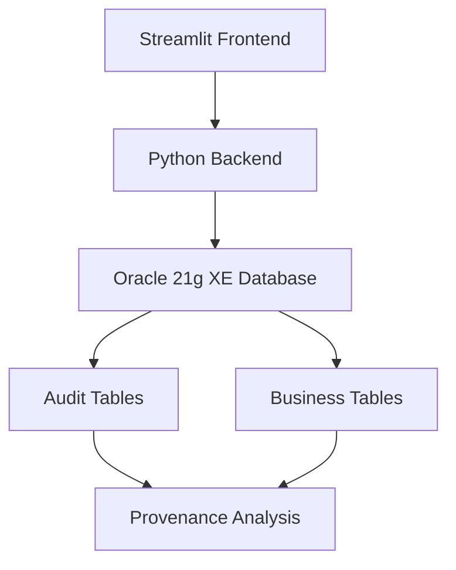

# 🛒 E-Commerce Provenance Tracking System


## Term Final Project -
## 📚 Course : CSE464 (Advance Database Systems)

[](https://python.org)
[](https://streamlit.io)
[](https://oracle.com)
[](https://opensource.org/licenses/MIT)

A comprehensive provenance tracking system for e-commerce applications built with **Streamlit** and **Oracle 21g XE**. This system provides complete audit trails, lineage tracking, and advanced provenance analysis using WHO/WHAT/WHEN/WHY/HOW/WHERE methodology.

# 🎯 What Can Users Do With This System?

## 🔍 For Business Users

Business users can view live data for customers, products, orders, and payments, track inventory levels and product performance, monitor order processing from placement to delivery, and oversee payment transactions and financial flows. The system enables users to find out who made changes to their data, discover when business events occurred, understand why prices or orders were changed, and trace how orders progressed through different statuses. Additionally, users can analyze customer behavior and purchasing patterns, track product performance and sales trends, identify bottlenecks in order fulfillment, and monitor staff activity and system usage.


## 🔧 For Technical Users

Technical users benefit from features that ensure data integrity with complete audit trails, meet compliance requirements (such as SOX, GDPR, and PCI-DSS), log all database modifications automatically, track user accountability for every change, and detect unauthorized changes or security issues. The system also allows users to trace individual records through their lifecycle, map customer journeys from registration to purchase, analyze data lineage and information flow, and generate compliance reports for audits.

## ⚡ Quick Actions

| I Want To...                        | Use This Feature                |
|--------------------------------------|---------------------------------|
| See who changed a product price      | Individual Product Trace        |
| Track a customer's complete history  | Customer Journey Lineage        |
| Find all changes in the last week    | Audit Logs with Date Filter     |
| Understand why an order was cancelled| WHY-Provenance Query            |
| Monitor staff database activity      | WHERE-Provenance Analysis       |
| Generate compliance reports          | Analytics Dashboard             |
| Investigate suspicious transactions  | Advanced Search & Filtering     |

## 💡 Real-World Use Cases

- **E-commerce Manager:** "Why did our best-selling product's price change?"
- **Compliance Officer:** "Show me all customer data modifications for the audit."
- **Customer Service:** "What's the history of this customer's orders?"
- **Business Analyst:** "Which products have the most price changes?"
- **Security Admin:** "Who accessed payment data last month?"
- **Store Owner:** "How long do orders stay in 'processing' status?"

## 🎯 Key Benefits

- **Automatic tracking** of all changes
- **Interactive analytics** and visualizations
- **Time travel** to view historical data
- **Full accountability** for every user action
- **Compliance-ready** audit trails
- **Business performance insights**

Perfect for e-commerce, retail, finance, healthcare, and any organization needing data

## 🏗️ **System Architecture**



### **Technology Stack**
- **Frontend**: Streamlit (Python web framework)
- **Backend**: Python with oracledb connector
- **Database**: Oracle 21g XE
- **Visualization**: Plotly Express & Graph Objects
- **Data Processing**: Pandas

## 🚀 **Quick Start**

### **Prerequisites**
- Python 3.8+
- Oracle 21g XE Database
- Git

### **Installation**

1. **Clone the repository**
   ```bash
   git clone https://github.com/yourusername/ecommerce-provenance-system.git
   cd ecommerce-provenance-system
   ```

2. **Install dependencies**
   ```bash
   pip install -r requirements.txt
   ```

3. **Setup Oracle Database**
   ```bash
   # Connect to Oracle as system user
   sqlplus system/your_password@localhost:1521/XEPDB1
   
   # Run the database setup script
   @database/ecommerce_provenance_db.sql
   ```

4. **Configure database connection**
   ```python
   # Edit app/config.py
   DB_USER = "system"
   DB_PASSWORD = "your_password"
   DB_DSN = "localhost:1521/XEPDB1"
   ```

5. **Run the application**
   ```bash
   streamlit run app/ecommerce_app.py
   ```

6. **Access the application**
   ```
   Open your browser and navigate to: http://localhost:8501
   ```

## 📊 **Application Tabs**

### **1. Current Data (📊)**
View real-time system data across all entities:
- **Users**: Active user accounts with roles
- **Customers**: Customer profiles and contact information
- **Products**: Product catalog with pricing and inventory
- **Orders**: Order summaries with status tracking
- **Payments**: Payment transactions and methods

### **2. Audit Logs (📜)**
Complete change history with filtering:
- Date range filtering
- Multi-entity tracking (Products, Orders, Customers, Payments)
- Before/after value comparison
- User attribution and timestamps

### **3. Provenance Queries (🔍)**
Advanced provenance analysis:

#### **WHY-Provenance**
- Business justifications for changes
- Price change reasons with impact analysis
- Regulatory compliance tracking

#### **HOW-Provenance**
- Process flow and state transitions
- Order status progression analysis
- Time-in-state calculations

#### **WHERE-Provenance**
- Source attribution and user activity
- Cross-table change tracking
- User action patterns

### **4. Analytics Dashboard (📈)**
System insights and patterns:
- Change summary by table and operation type
- User activity analysis
- Visual analytics with charts and graphs
- Trend analysis over time

### **5. Individual Traces (🔎)**
Detailed record history:
- **Product Trace**: Complete lifecycle from creation to current state
- **Order Trace**: Status progression with timeline visualization
- **Customer Trace**: Profile evolution over time

### **6. Customer Journey (🛤️)**
End-to-end experience tracking:
- Complete customer interaction history
- Cross-entity analysis (Customer → Orders → Payments)
- Timeline visualization
- Narrative journey description

## 🔧 **Database Schema**

### **Core Business Tables**
- `Users` - System user accounts
- `Customers` - Customer profiles
- `Products` - Product catalog
- `Orders` - Order management
- `OrderItems` - Order line items
- `Payments` - Payment transactions

### **Audit Tables**
- `Audit_Log` - Generic audit trail
- `Audit_Products` - Product-specific changes
- `Audit_Orders` - Order-specific changes
- `Audit_Customers` - Customer-specific changes
- `Audit_Payments` - Payment-specific changes

### **Triggers**
Automatic audit logging for all CRUD operations on business tables.


## 📋 **API Reference**

### **Core Functions**


#### **Provenance Analysis**
```python
def get_why_provenance():
    """Returns WHY-provenance data for price changes."""

def get_how_provenance():
    """Returns HOW-provenance data for status transitions."""

def get_where_provenance():
    """Returns WHERE-provenance data for user actions."""
```


## 📄 **License**

This project is licensed under the MIT License - see the [LICENSE](LICENSE) file for details.

## 🤝 **Contributing**

1. Fork the repository
2. Create a feature branch (`git checkout -b feature/amazing-feature`)
3. Commit your changes (`git commit -m 'Add amazing feature'`)
4. Push to the branch (`git push origin feature/amazing-feature`)
5. Open a Pull Request

See [CONTRIBUTING.md](CONTRIBUTING.md) for detailed guidelines.


## 🎖️ **Acknowledgments**

- Oracle Database for robust transaction processing
- Streamlit for rapid web application development
- Plotly for interactive data visualization
- Python community for excellent libraries

## 📊 **Project Status**

- ✅ **Core Features**: Complete
- ✅ **Database Schema**: Stable
- ✅ **Web Interface**: Functional
- 🔄 **Documentation**: In Progress
- 🔄 **Testing**: Expanding
- 📋 **Roadmap**: [View Roadmap](https://github.com/yourusername/ecommerce-provenance-system/projects)

---

**Made with ❤️ for data provenance and transparency**
