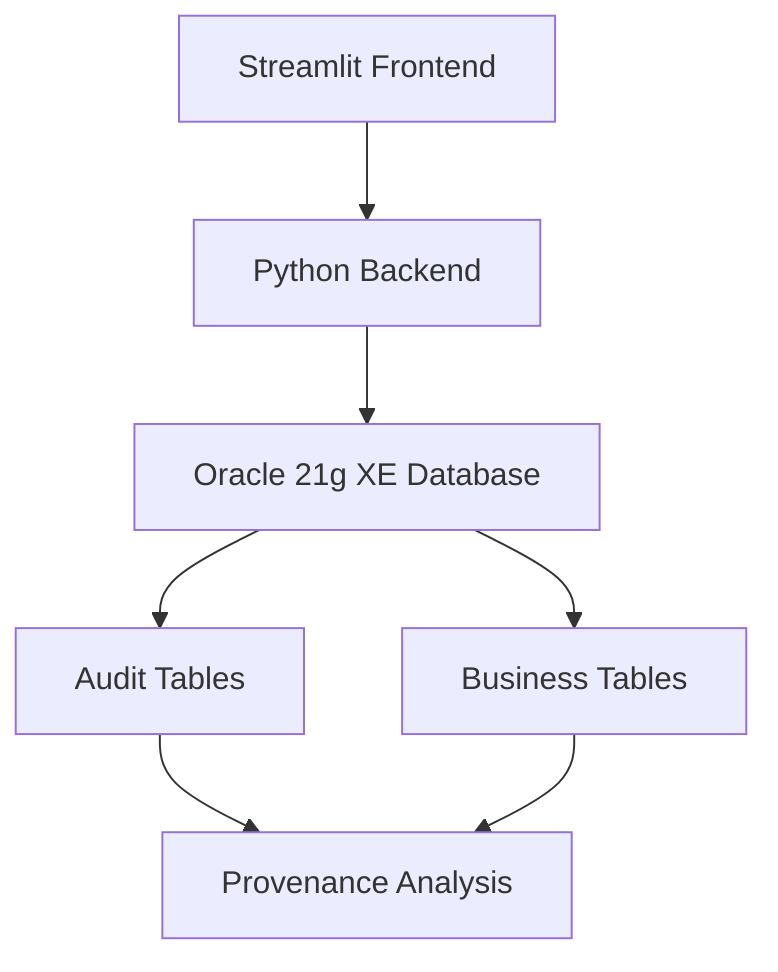

# 🛒 E-Commerce Provenance Tracking System

# Course : **CSE464**  **Advance Database Systems**
**Advance Database Systems**

[](https://python.org)
[](https://streamlit.io)
[](https://oracle.com)
[](https://opensource.org/licenses/MIT)

A comprehensive provenance tracking system for e-commerce applications built with **Streamlit** and **Oracle 21g XE**. This system provides complete audit trails, lineage tracking, and advanced provenance analysis using WHO/WHAT/WHEN/WHY/HOW/WHERE methodology.

## 🎯 **Features**

- **📊 Real-time Data Visualization**: Current system data across all entities
- **📜 Complete Audit Trail**: Track all changes with timestamps and user attribution
- **🔍 Advanced Provenance Analysis**: WHY/HOW/WHERE provenance queries
- **📈 Analytics Dashboard**: System insights and user activity patterns
- **🔎 Individual Record Tracing**: Detailed history for specific records
- **🛤️ Customer Journey Tracking**: End-to-end customer experience lineage
- **🛡️ Security Features**: User attribution and role-based tracking

## 🏗️ **System Architecture**



### **Technology Stack**
- **Frontend**: Streamlit (Python web framework)
- **Backend**: Python with oracledb connector
- **Database**: Oracle 21g XE
- **Visualization**: Plotly Express & Graph Objects
- **Data Processing**: Pandas

## 🚀 **Quick Start**

### **Prerequisites**
- Python 3.8+
- Oracle 21g XE Database
- Git

### **Installation**

1. **Clone the repository**
   ```bash
   git clone https://github.com/yourusername/ecommerce-provenance-system.git
   cd ecommerce-provenance-system
   ```

2. **Install dependencies**
   ```bash
   pip install -r requirements.txt
   ```

3. **Setup Oracle Database**
   ```bash
   # Connect to Oracle as system user
   sqlplus system/your_password@localhost:1521/XEPDB1
   
   # Run the database setup script
   @database/ecommerce_provenance_db.sql
   ```

4. **Configure database connection**
   ```python
   # Edit app/config.py
   DB_USER = "system"
   DB_PASSWORD = "your_password"
   DB_DSN = "localhost:1521/XEPDB1"
   ```

5. **Run the application**
   ```bash
   streamlit run app/ecommerce_app.py
   ```

6. **Access the application**
   ```
   Open your browser and navigate to: http://localhost:8501
   ```

## 📊 **Application Tabs**

### **1. Current Data (📊)**
View real-time system data across all entities:
- **Users**: Active user accounts with roles
- **Customers**: Customer profiles and contact information
- **Products**: Product catalog with pricing and inventory
- **Orders**: Order summaries with status tracking
- **Payments**: Payment transactions and methods

### **2. Audit Logs (📜)**
Complete change history with filtering:
- Date range filtering
- Multi-entity tracking (Products, Orders, Customers, Payments)
- Before/after value comparison
- User attribution and timestamps

### **3. Provenance Queries (🔍)**
Advanced provenance analysis:

#### **WHY-Provenance**
- Business justifications for changes
- Price change reasons with impact analysis
- Regulatory compliance tracking

#### **HOW-Provenance**
- Process flow and state transitions
- Order status progression analysis
- Time-in-state calculations

#### **WHERE-Provenance**
- Source attribution and user activity
- Cross-table change tracking
- User action patterns

### **4. Analytics Dashboard (📈)**
System insights and patterns:
- Change summary by table and operation type
- User activity analysis
- Visual analytics with charts and graphs
- Trend analysis over time

### **5. Individual Traces (🔎)**
Detailed record history:
- **Product Trace**: Complete lifecycle from creation to current state
- **Order Trace**: Status progression with timeline visualization
- **Customer Trace**: Profile evolution over time

### **6. Customer Journey (🛤️)**
End-to-end experience tracking:
- Complete customer interaction history
- Cross-entity analysis (Customer → Orders → Payments)
- Timeline visualization
- Narrative journey description

## 🔧 **Database Schema**

### **Core Business Tables**
- `Users` - System user accounts
- `Customers` - Customer profiles
- `Products` - Product catalog
- `Orders` - Order management
- `OrderItems` - Order line items
- `Payments` - Payment transactions

### **Audit Tables**
- `Audit_Log` - Generic audit trail
- `Audit_Products` - Product-specific changes
- `Audit_Orders` - Order-specific changes
- `Audit_Customers` - Customer-specific changes
- `Audit_Payments` - Payment-specific changes

### **Triggers**
Automatic audit logging for all CRUD operations on business tables.

## 📈 **Sample Queries**

### **WHY-Provenance: Product Price Changes**
```sql
SELECT p.name, ap.old_price, ap.new_price, ap.reason, ap.changed_at
FROM Audit_Products ap
JOIN Products p ON ap.product_id = p.product_id
WHERE ap.old_price != ap.new_price
ORDER BY ap.changed_at DESC;
```

### **HOW-Provenance: Order Status Flow**
```sql
SELECT order_id, old_status, new_status, changed_at
FROM Audit_Orders
WHERE order_id = 1
ORDER BY changed_at ASC;
```

### **WHERE-Provenance: User Activity**
```sql
SELECT u.username, al.table_name, COUNT(*) as changes
FROM Audit_Log al
JOIN Users u ON al.changed_by = u.user_id
GROUP BY u.username, al.table_name;
```

## 🛡️ **Security Features**

- **SQL Injection Prevention**: Parameterized queries
- **User Attribution**: Complete audit trail with user tracking
- **Role-Based Access**: User roles recorded with all actions
- **Session Tracking**: Connection and session information logging

## 📋 **API Reference**

### **Core Functions**

#### **Database Connection**
```python
@st.cache_resource
def init_connection():
    """Initializes cached Oracle database connection."""
```

#### **Query Execution**
```python
def run_query(query, params=None):
    """Executes SQL query with optional parameters."""
```

#### **Provenance Analysis**
```python
def get_why_provenance():
    """Returns WHY-provenance data for price changes."""

def get_how_provenance():
    """Returns HOW-provenance data for status transitions."""

def get_where_provenance():
    """Returns WHERE-provenance data for user actions."""
```

## 🧪 **Testing**

Run the test suite:
```bash
python -m pytest tests/
```

### **Test Coverage**
- Database connectivity
- Query execution
- Data validation
- UI component rendering

## 🐛 **Troubleshooting**

### **Common Issues**

#### **Database Connection Failed**
```
Error: ORA-12541: TNS:no listener
```
**Solution**: Ensure Oracle database is running and listener is active.

#### **Empty Query Results**
**Cause**: Missing audit triggers or no data in date range.
**Solution**: Verify triggers are enabled and data exists.

#### **Performance Issues**
**Solution**: Use date range filters and add database indexes.

See [TROUBLESHOOTING.md](docs/TROUBLESHOOTING.md) for detailed solutions.

## 📄 **License**

This project is licensed under the MIT License - see the [LICENSE](LICENSE) file for details.

## 🤝 **Contributing**

1. Fork the repository
2. Create a feature branch (`git checkout -b feature/amazing-feature`)
3. Commit your changes (`git commit -m 'Add amazing feature'`)
4. Push to the branch (`git push origin feature/amazing-feature`)
5. Open a Pull Request

See [CONTRIBUTING.md](CONTRIBUTING.md) for detailed guidelines.

## 📞 **Support**

- **Documentation**: [docs/](docs/)
- **Issues**: [GitHub Issues](https://github.com/yourusername/ecommerce-provenance-system/issues)
- **Discussions**: [GitHub Discussions](https://github.com/yourusername/ecommerce-provenance-system/discussions)

## 🎖️ **Acknowledgments**

- Oracle Database for robust transaction processing
- Streamlit for rapid web application development
- Plotly for interactive data visualization
- Python community for excellent libraries

## 📊 **Project Status**

- ✅ **Core Features**: Complete
- ✅ **Database Schema**: Stable
- ✅ **Web Interface**: Functional
- 🔄 **Documentation**: In Progress
- 🔄 **Testing**: Expanding
- 📋 **Roadmap**: [View Roadmap](https://github.com/yourusername/ecommerce-provenance-system/projects)

---

**Made with ❤️ for data provenance and transparency**
